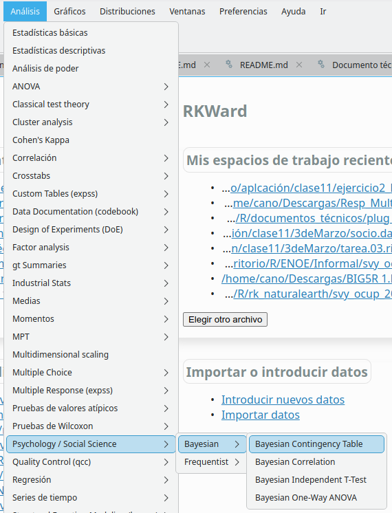
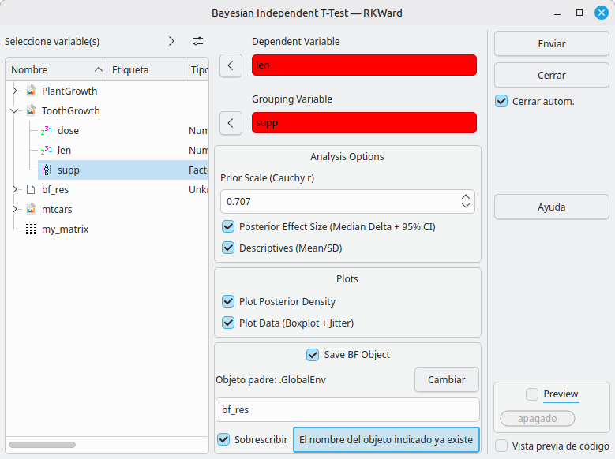
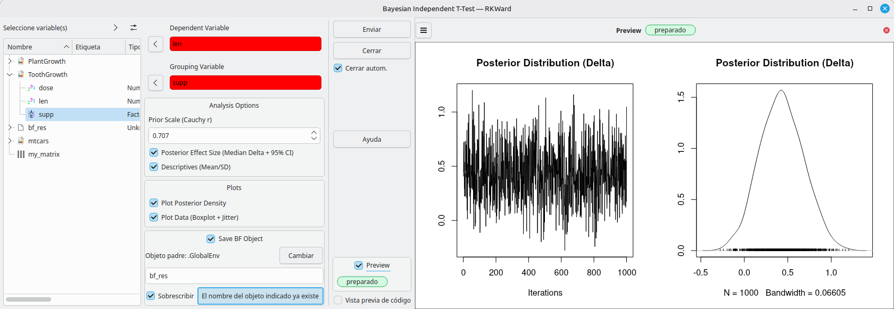
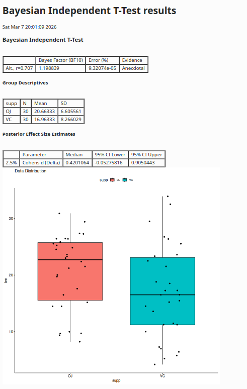

# rk.bayesian


[](https://github.com/AlfCano/rk.bayesian/actions/workflows/lintr.yml)


**rk.bayesian** is an external plug-in for [RKWard](https://rkward.kde.org/) that introduces a full suite of **Bayesian** statistical tests powered by the `BayesFactor` package. It is designed to provide "Jamovi-like" output, including Bayes Factors, posterior effect size estimates, descriptive statistics, and visualization plots.

## Features

### Evidence-Based Statistics
*   **Bayesian T-Tests:** Calculate Bayes Factors ($BF_{10}$), Posterior Effect Size ($\delta$) with Credible Intervals, and Raincloud plots (Boxplot + Jitter + Density).
*   **Bayesian ANOVA:** Calculate Bayes Factors for model comparison, group descriptives, and data plots.
*   **Bayesian Correlation:** Test for associations ($BF_{10}$), estimate posterior Rho ($\rho$), and generate scatterplots with density curves.
*   **Bayesian Contingency:** Test for independence in contingency tables using Independent (Poisson) or Joint Multinomial sampling.
*   **Automatic Interpretation:** Results tables include evidence strength labels (Anecdotal, Moderate, Strong, etc.) based on Jeffreys' scale.

## 🌍 Internationalization

The interface is fully localized to match your RKWard language settings:

*   🇺🇸 **English** (Default)
*   🇪🇸 **Spanish** (`es`)
*   🇫🇷 **French** (`fr`)
*   🇩🇪 **German** (`de`)
*   🇧🇷 **Portuguese** (Brazil) (`pt_BR`)

## Dependencies

This plugin relies on the following R packages:
*   `BayesFactor` (Bayesian inference)
*   `dplyr` (Data manipulation)
*   `ggpubr` (Plots)
*   `rkwarddev` (Development)

## Installation

### Installing from GitHub
You can install the latest version directly from GitHub using the `devtools` or `remotes` package in R:

1.  Execute the commands printed in the console:
```r
library(devtools) # or library(remotes)
install_github("AlfCano/rk.bayesian")
```
2.  Restart RKWard.

## Usage Guide & Tutorials

The plugin adds a new entry to the main menu under:
**Analysis > Psychology / Social Science > Bayesian**

### Phase 1: Data Preparation
To follow these tutorials, please run this code in the **RKWard R Console** to load the necessary datasets:

```r
# Load standard datasets
data(ToothGrowth)  # For T-Tests
data(PlantGrowth)  # For ANOVA
data(mtcars)       # For Correlation

# Create a Matrix for Contingency Table test
my_matrix <- matrix(c(20, 5, 10, 30), nrow = 2, 
                    dimnames = list(c("Male", "Female"), c("Yes", "No")))
```

### Phase 2: Bayesian Independent T-Test
**Goal:** Check the strength of evidence for the difference in tooth length (`len`) by supplement (`supp`).

1.  **Menu:** `Psychology / Social Science > Bayesian > Bayesian Independent T-Test`

 
 
 *Screenshot of the path in the main menu.*

2.  **Dependent Variable:** `len`.

  
  
  *Screenshot of the RKWard interface running the Bayesian T-Test module and setting the dependent and independent variables.*  

3.  **Grouping Variable:** `supp`.

4.  **Options:** Check "Posterior Effect Size" and "Plot Posterior Density".

     

  *Screenshot of the RKWard interface running the Bayesian T-Test module and setting the dependent and independent variables with preview.*

5.  **Submit**.
*   *Result:* A table showing the **Bayes Factor ($BF_{10}$)**, the Median Posterior Effect Size (Cohen's d) with 95% Credible Intervals, and a plot of the posterior distribution.
  
  
  
  *Screenshot of the output in HTML format, showing the results of the Bayes Factor ($BF_{10}$), the descriptive table and the corresponding graphic rendering.*
 
### Phase 3: Bayesian One-Way ANOVA
**Goal:** Compare models for plant weight (`weight`) across groups (`group`).
1.  **Menu:** `Psychology / Social Science > Bayesian > Bayesian One-Way ANOVA`
2.  **Variables:** Select `weight` (DV) and `group` (Factor).
3.  **Options:** Check "Descriptives" and "Plot Data".
4.  **Submit**.
    *   *Result:* A table comparing the `group` model against the Intercept-only model with evidence labels, plus a table of group means/SDs.

### Phase 4: Bayesian Correlation
**Goal:** Test association between MPG and Horsepower.
1.  **Menu:** `Psychology / Social Science > Bayesian > Bayesian Correlation`
2.  **Variable 1:** `mpg`.
3.  **Variable 2:** `hp`.
4.  **Options:** Check "Plot Scatterplot".
5.  **Submit**.
    *   *Result:* The Bayes Factor for the correlation, posterior estimate for Rho, and a scatterplot with regression line.

### Phase 5: Bayesian Contingency Table
**Goal:** Test independence of rows/columns in a matrix.
1.  **Menu:** `Psychology / Social Science > Bayesian > Bayesian Contingency Table`
2.  **Contingency Table:** Select `my_matrix`.
3.  **Sampling Type:** Independent (Poisson) or Joint Multinomial.
4.  **Submit**.
    *   *Result:* A Bayes Factor testing the independence of the rows and columns.

## Author
**Alfonso Cano**  
Benemérita Universidad Autónoma de Puebla  
License: GPL (>= 3)

---
*This plugin was developed with the assistance of **Gemini**, a large language model by Google.*
